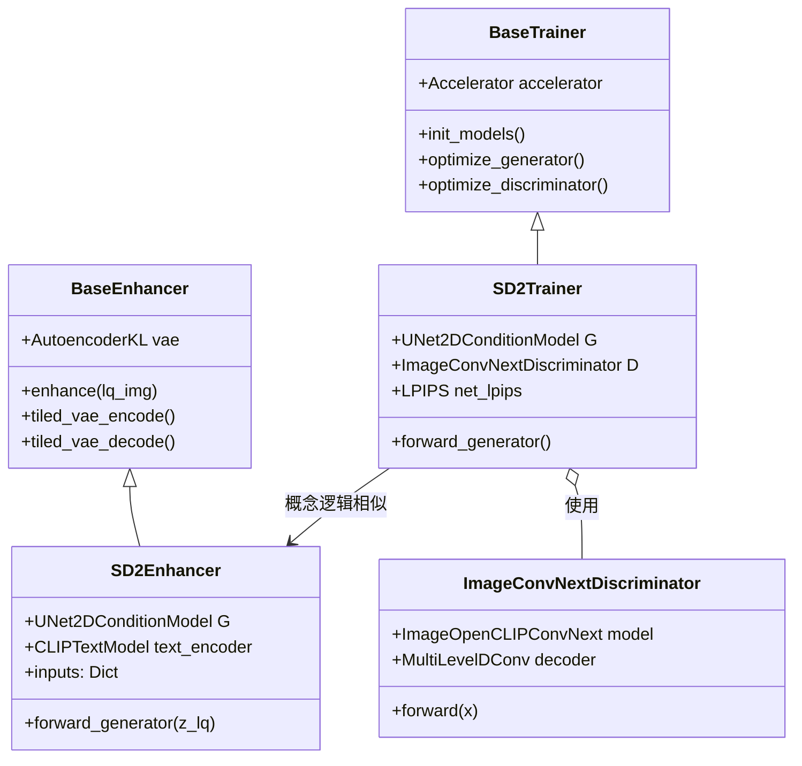

# HYPIR 技术报告

## 1. 项目目录结构分析

### 1.1 目录树
```
HYPIR/
├── app.py                      # Gradio Web 演示应用
├── configs/                    # 训练和推理的配置文件
│   ├── sd2_gradio.yaml
│   └── sd2_train.yaml
├── HYPIR/                      # 核心源代码包
│   ├── dataset/                # 数据加载和增强
│   │   ├── batch_transform.py  # 在线退化管道 (模糊/噪声/JPEG)
│   │   ├── realesrgan.py       # HQ (高质量) 图像的数据集加载器
│   │   └── ...
│   ├── enhancer/               # 推理和修复逻辑
│   │   ├── base.py             # 处理 VAE tiling (分块) 的增强器基类
│   │   └── sd2.py              # 基于 Stable Diffusion v2 的修复实现
│   ├── model/                  # 神经网络架构
│   │   ├── backbone.py         # 特征提取器 (OpenCLIP/ConvNext)
│   │   └── D.py                # 判别器定义
│   ├── trainer/                # 训练循环和优化
│   │   ├── base.py             # 处理 accelerator/logging 的基础训练器
│   │   └── sd2.py              # 针对 SD2 修复的专用训练器
│   └── utils/                  # 工具函数 (日志记录, tiling 等)
├── train.py                    # 训练入口点
├── test.py                     # 测试入口点
└── ...
```

### 1.2 关键组件总结

- **`HYPIR/model/backbone.py`**: 定义了 `ImageOpenCLIPConvNext`，这是 OpenCLIP 的 ConvNeXt 模型的封装，用于为视觉辅助判别器提取语义特征。
- **`HYPIR/model/D.py`**: 实现了 `ImageConvNextDiscriminator`，这是一个复杂的判别器，利用 ConvNeXt 的多级特征来引导生成器产生逼真的输出。
- **`HYPIR/enhancer/sd2.py`**: 包含 `SD2Enhancer`，它通过注入 LQ (低质量) 潜在特征，调整预训练的 Stable Diffusion v2 UNet 用于图像修复。
- **`HYPIR/dataset/realesrgan.py`**: 负责加载 HQ (高质量) 图像并为退化管道做准备的数据集类。
- **`HYPIR/dataset/batch_transform.py`**: 在训练期间在线实现 "Real-ESRGAN" 风格的退化管道，应用复杂的模糊、噪声和压缩序列，从 HQ 输入合成逼真的 LQ 图像。
- **`HYPIR/trainer/sd2.py`**: 管理训练循环的编排引擎，包括损失计算 (L2 + LPIPS + GAN)、优化器步骤以及与 Hugging Face `accelerate` 库的交互。

---

## 2. 核心架构与数据流

### 2.1 类架构 (Mermaid)



### 2.2 数据流与张量变换

核心思想是使用冻结的 Stable Diffusion U-Net 作为修复骨干网络。模型在 VAE 的 Latent Space (潜空间) 中运行。

```mermaid
flowchart LR
    subgraph Input Processing [输入处理]
    HQ[HQ 图像] -- 退化管道 --> LQ[LQ 图像]
    LQ -- VAE 编码器 --> Z_LQ[Latent LQ\n(4, H/8, W/8)]
    end

    subgraph Restoration [修复 (一步扩散)]
    Z_LQ -- "缩放因子" --> Z_IN
    T[固定时间步 t=200] --> U_NET
    Prompt[文本嵌入] --> U_NET
    
    Z_IN -- 输入 --> U_NET[SD2 UNet\n(LoRA 适配器)]
    U_NET -- 输出 --> EPS[预测噪声/速度]
    
    EPS -- Scheduler Step --> Z_REC[修复后的 Latent]
    end

    subgraph Output [输出]
    Z_REC -- VAE 解码器 --> REC[修复后的图像]
    REC -- 小波色彩修正 --> FINAL[最终输出]
    end
```

### 2.3 模块拆解

#### 2.3.1 `SD2Enhancer` (生成器逻辑)
位于 `HYPIR/enhancer/sd2.py`。

- **初始化 (`__init__`)**:
    - 加载 Stable Diffusion v2 的 **VAE**、**Tokenizer** 和 **Text Encoder**。
    - 加载 **U-Net** (`UNet2DConditionModel`)。
    - **LoRA 注入**: 不微调整个 U-Net，而是将 Low-Rank Adaptation (LoRA) 层注入到特定模块（在配置中定义，如 `to_k`, `to_v`, `conv_in` 等）。这允许模型在适应修复任务的同时保留生成先验。
    - 通常将模型设置为评估模式 (`eval()`)，但在训练中，LoRA 层是可训练的。

- **前向传播 (`forward_generator`)**:
    - **输入**: `z_lq` (低质量图像的 Latent 表示)。
    - **缩放**: `z_in = z_lq * scaling_factor`。SD VAE 需要对 Latents 进行缩放。
    - **条件化 (Conditioning)**:
        - **时间 (Time)**: 使用固定的时间步 `t` (例如 200)。这有效地将修复视为“从轻微噪声状态去噪”或“一步转换”。代码在训练期间**不**执行迭代 DDIM 采样；它基于 $t$ 隐含的固定噪声水平假设，在一次前向传递中预测干净图像。
        - **文本 (Text)**: 通过交叉注意力 (cross-attention) 使用文本嵌入（通常为空或简单的提示词）。
    - **预测**: U-Net 预测噪声（或速度 velocity，取决于 scheduler）。
    - **重建**: 调用 `self.scheduler.step` 从预测中恢复原始样本 `z`。

#### 2.3.2 `ImageConvNextDiscriminator` (判别器/评论家)
位于 `HYPIR/model/D.py`。

- **骨干网络 (Backbone)**: 使用 `ConvNeXt` (来自 OpenCLIP) 提取深层语义特征。这是一种“视觉辅助 (Vision-Aided)”方法，意味着判别器关注高层语义而不仅仅是像素级伪影。
- **多级解码 (Multi-Level Decoding)**: `MultiLevelDConv` 解码器从 ConvNeXt 的不同阶段获取特征。
- **损失计算**: 它计算基于特征匹配或直接分类的损失，帮助生成器产生感知上逼真的纹理。

---

## 3. 训练与推理流程

### 3.1 数据加载与增强 (退化模型)
系统不仅仅是加载图像对；它会在线合成 LQ 图像以确保鲁棒性。
- **文件**: `HYPIR/dataset/batch_transform.py` -> `RealESRGANBatchTransform`。
- **流程**:
    1.  **队列 (Queueing)**: 维护图像队列以增加 batch 的多样性（源自 Real-ESRGAN 的技术）。
    2.  **第一阶段退化**:
        - **模糊**: 随机核（各向同性、各向异性、广义高斯）。
        - **调整大小**: 随机上/下采样。
        - **噪声**: 高斯和泊松噪声。
        - **压缩**: JPEG 压缩 (使用 `DiffJPEG`)。
    3.  **第二阶段退化** (递归应用):
        - 第二轮模糊、调整大小和噪声，以模拟复杂的、重复的退化（常见于互联网图像）。
    4.  **最终步骤**:
        - **Sinc 滤波器**: 模拟振铃伪影或传感器效应。
        - **回调大小 (Resize Back)**: 确保最终的 LQ 图像与目标训练尺寸匹配。

### 3.2 训练循环
位于 `HYPIR/trainer/sd2.py`。

- **优化目标**: 模型预测“干净”的 latent。
- **损失组件**:
    1.  **像素损失 ($L_2$)**: `MSE(predicted_img, gt_img)`。强制保真度。
    2.  **感知损失 ($L_{LPIPS}$)**: 使用基于 VGG 的 LPIPS 确保感知相似性。
    3.  **GAN 损失 ($L_{Adv}$)**: 生成器试图欺骗 `ImageConvNextDiscriminator`。
- **步骤逻辑**:
    - **生成器步骤**: 冻结 D，前向 G，计算 $L_{Total} = \lambda_{L2} L_2 + \lambda_{LPIPS} L_{LPIPS} + \lambda_{GAN} L_{Adv}$。反向传播 G。
    - **判别器步骤**: 冻结 G，通过 D 前向真实图像，通过 D 前向生成图像。计算 hinge loss 或类似的 GAN loss。反向传播 D。
- **EMA**: 对生成器权重维护指数移动平均 (Exponential Moving Average)，以稳定训练并提高最终质量。

### 3.3 推理流程
位于 `HYPIR/enhancer/base.py`。

- **分块处理 (Tiled Processing)**:
    - 为了处理无法放入 GPU 显存的高分辨率图像，图像被分割成 **Tiles (块)**。
    - **Tiled VAE Encode**: LQ 图像被逐块编码到 latent space。
    - **Tiled Diffusion**: U-Net 在 latent tiles 上运行。
    - **Tiled VAE Decode**: 修复后的 latents 被逐块解码。
- **小波重建 (Wavelet Reconstruction)**:
    - `x = wavelet_reconstruction(x, ref)`: VAE 解码后，结果的低频内容通常被输入 (ref) 的低频内容替换或混合。这确保了颜色一致性，并防止 VAE 引入全局色偏，这是基于 SD 的修复中的常见问题。

---

## 4. 总结与建议

### 4.1 代码风格与质量
- **现代技术栈**: 该项目利用 `diffusers` 作为模型后端，利用 `accelerate` 进行训练循环管理。这是目前 PyTorch 生成模型的最新标准。
- **模块化**: 数据 (Dataset/Transform)、模型架构 (Enhancer/Discriminator) 和训练逻辑 (Trainer) 之间有清晰的分离。这使得代码库易于扩展。
- **配置**: 严重依赖 YAML 配置文件，使得实验无需更改代码即可复现。

### 4.2 方法论洞察
- **一步先验 (One-Step Prior)**: 代码实现了“一步”修复方法。通过固定时间步 $t$ (例如 200) 并训练模型直接从 $z_t$ 预测 $x_0$，它有效地将 Stable Diffusion 模型不作为生成采样器使用，而是作为一个强大的、预训练的特征提取器和去噪器。
- **LoRA 效率**: 使用 LoRA 确保了 Stable Diffusion 的大量知识得以保留，同时仅需微调一小部分参数用于修复任务。

### 4.3 改进建议
- **硬编码参数**: 一些参数（如数据集中的 kernel ranges）在 `__init__` 中是硬编码的，而不是完全暴露在配置中。将这些移动到 YAML 会提高灵活性。
- **文档**: 虽然代码很整洁，但在一些复杂区域（例如退化概率数学）的函数级文档 (docstrings) 比较稀疏。
